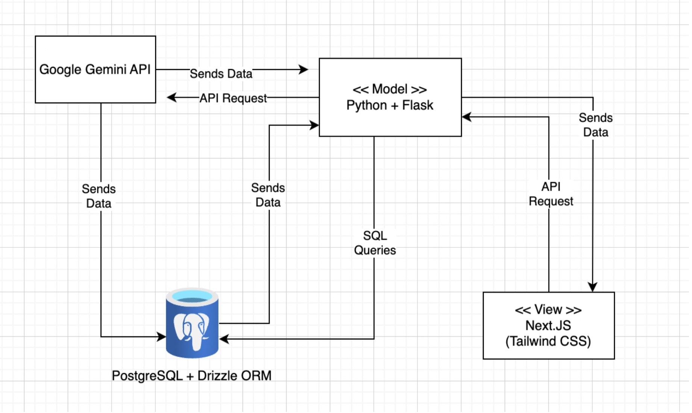
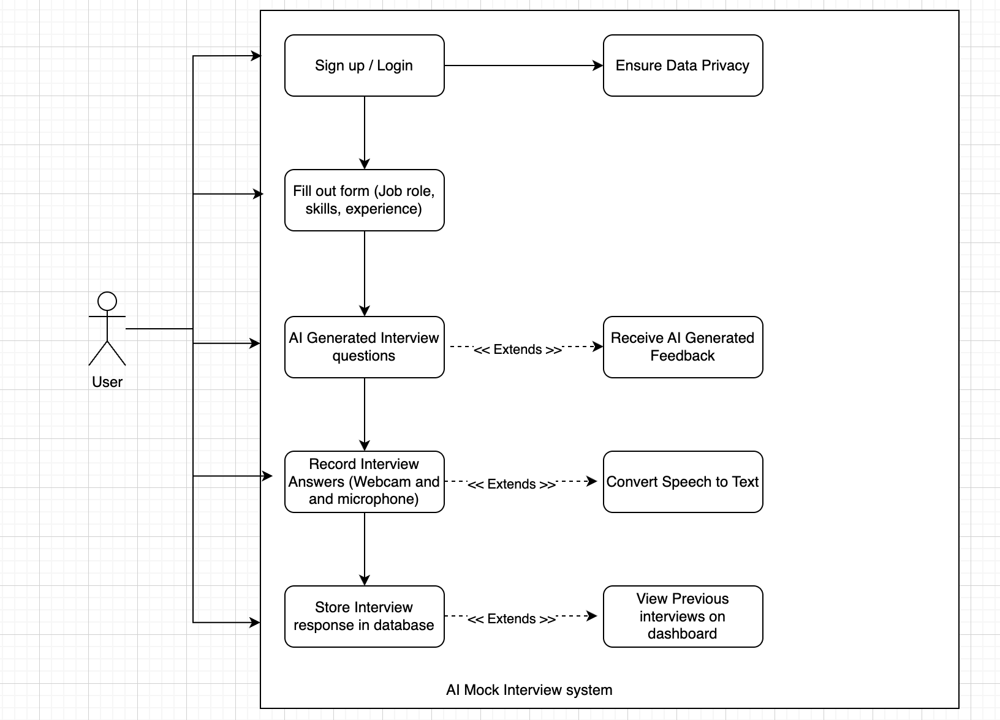

# PROJECT Design Documentation

## Team Information
* Team name: AI-Powered Mock Interview Application
* Team members
  * Vinayaka Viswanatha
  * Devaj Mody
  * Jahnavi Kaja
  * Ishitha Batchu

## Executive Summary

The AI-Powered Mock Interview Application is a web-based platform designed to help users practice and improve their interview skills through AI-generated questions, real-time feedback, and speech-to-text analysis.
We are planning to use Next.js (React) for the frontend, Flask for the backend,
PostgreSQL with Drizzle ORM for data management, and Google Gemini API for
AI-generated interview questions and feedback. Users can record their answers
using a webcam and microphone, and the system will analyze responses,
converting them into text for evaluation.

## Requirements

This section describes the features of the application.

### Definition of MVP

Registration & Login

* Users will be able to create an account using their email and password. The system  will ensure secure authentication and provide error messages for validation failures.

Interview Form Submission

  * Users will fill out a form specifying their job role, skills, and experience. This information will be used to generate AI-powered interview questions tailored to their profile.

AI-Generated Interview Questions

  * The system will use Google Gemini API to generate realistic interview questions based on the user’s input. This ensures that the interview experience is personalized and relevant.

Recording Interview Responses

  * Users will be able to record their answers using a webcam and microphone. This feature helps in self-evaluation and improving articulation before real interviews.

Speech-to-Text Conversion

  * The recorded audio will be transcribed into text using Google Speech-to-Text API. This allows users to analyze their responses, identify mistakes, and refine their answers.

Storing Interview Responses

  * The system will store users' interview answers in a PostgreSQL database using Drizzle ORM. This allows users to access and review their past responses anytime.

Viewing Past Interviews on Dashboard

  * Users will have a dashboard where they can view previous interview sessions, track their progress, and compare different interview attempts.

AI-Generated Feedback on Responses

  * After completing an interview, users will receive AI-driven feedback that highlights strengths and areas for improvement. This feedback will be generated using Google Gemini API.

Data Privacy & Security

  * All interview responses will be stored securely, ensuring that only the respective user can access them. Authentication and authorization will be managed using Clerk for security.

Clean & User-Friendly UI

  * The application will have a modern and intuitive UI built with Next.js and TailwindCSS, ensuring a smooth user experience.

### MVP Features

Registration & Login
  * As a user, I want to sign up and log in using
email and password so that I can securely access my account.

Interview Form Submission
  * As a user, I want to fill out a form where I
input my skills, experience, and job role so
that the AI can generate relevant interview
questions.

AI-Generated Interview Questions
  * As a user, I want to receive AI-generated
interview questions based on my selected topic or job role so that I can prepare effectively.

Recording Interview Responses
  * As a user, I want to record my interview
answers using my webcam and microphone so that I can review my performance later.

Speech-to-Text Conversion
  * As a user, I want to have my spoken answers
converted into text so that I can analyze and improve my responses.

Storing Interview Responses
  * As a user, I want to store my interview
responses in a database so that I can access
them later for review.

Viewing Past Interviews on Dashboard
  * As a user, I want to view my previous
interview sessions and answers on my dashboard so that I can track my progress.

AI-Generated Feedback on Responses
  * As a user, I want to receive AI-generated
feedback on my responses so that I can improve my answers.

Data Privacy & Security
  * As a user, I want my interview data to be
private and secure, ensuring only I can access my responses.

Clean & User-Friendly UI
  * As a user, I want to have a clean and modern
UI so that the app is easy to navigate and visually appealing.

## Architecture and Design

This section describes the application architecture.

### Software Architecture

The AI-Powered Mock Interview Application follows the Model-View-Model (MVM) architectural pattern, ensuring a clean separation of concerns between the frontend, backend, and data processing services. This architecture enables scalability, modularity, and ease of integration with AI services like Google Gemini API.

The system consists of the following key components:
* View (Next.js + Tailwind CSS) → Manages the user interface and interactions.
* Model (Python + Flask Backend) → Handles business logic, AI interactions, and database management.
* External APIs (Google Gemini API, Speech-to-Text API) → Provides AI-generated interview questions, feedback, and   speech transcription.
* Database (PostgreSQL + Drizzle ORM) → Stores user data, interview responses, and system logs.

### Use Cases

The Use Case Diagram illustrates how users interact with the AI-Powered Mock Interview Application. It highlights key functionalities such as user authentication, AI-generated interview questions, recording responses, speech-to-text conversion, and AI feedback.

* User Authentication → Users must sign up or log in to access the platform, ensuring data privacy.
* AI-Generated Questions & Feedback → The system uses Google Gemini API to generate custom interview questions and provide feedback.
* Recording & Speech Processing → Users can record their answers via webcam/microphone, and the Speech-to-Text API converts spoken responses into text.
* Interview Storage & Review → Responses are stored in PostgreSQL and can be viewed later on the dashboard.

